<h1 align="center">SpotiTheme</h1>

<strong>29 JSON themes for Spotify on Android, applied through a pinned Xposed reflection profile.</strong>

  
  
  
  
  
  

<table align="center">
  <tr>
    <th align="center">Catppuccin Mocha · Home</th>
    <th align="center">Catppuccin Latte · Home</th>
  </tr>
  <tr>
    <td align="center">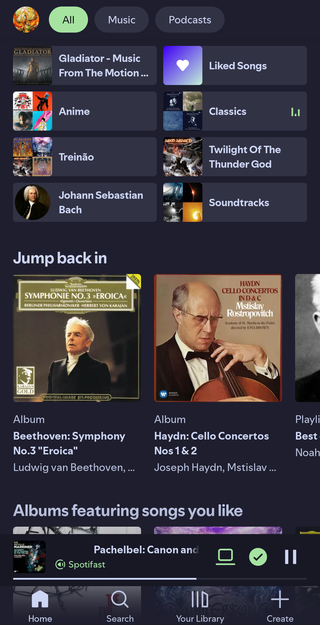</td>
    <td align="center">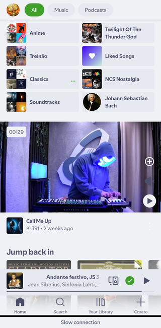</td>
  </tr>
</table>

<em>Captures from Spotify on Android 16.</em>

> [!IMPORTANT]
> SpotiTheme targets <strong>Spotify 9.1.86.2432 / version code 146555520</strong>. A different Spotify build needs a separately verified reflection profile and fresh device acceptance; this release does not claim compatibility with newer versions.

## What it does

SpotiTheme applies semantic color palettes to supported Spotify Android surfaces. It packages 29 JSON palettes, can read additional <code>.json</code> files from a user-selected folder, and can optionally derive a static color palette from the current artwork with <strong>Auto Theme</strong>.

- <strong>Pinned reflection profile:</strong> resolves exact members for Spotify 9.1.86.2432 instead of searching Spotify bytecode at runtime.
- <strong>Broad surface coverage:</strong> Encore and Compose palettes, Home, Library, Search, playlist creation, mini-player, expanded player, selected media cards, SongDNA, Credits, and Spotify's in-app Connect indicator.
- <strong>Theme library:</strong> 29 bundled themes, with regular Catppuccin Mocha as the default and only bundled Mocha variant.
- <strong>User themes:</strong> choose a folder with Android's document picker; refresh to import valid version-1 JSON palettes.
- <strong>Two installation paths:</strong> Vector/Zygisk for rooted devices or a prepared LSPatch install for rootless devices.

Animated artwork backgrounds and their dependent motion, drift, blur, and quality controls are excluded from this MVP. The expanded player handles its backdrop automatically: confirmed square album artwork uses a clear theme background, while a confirmed featured-video surface keeps Spotify's native treatment. Unrecognized media paths keep native behavior. Static Auto Theme color extraction and Use album artwork colors remain separate color controls.

The former built-in Mocha Mauve entry is not included. A saved selection using its retired identifier falls back to regular Catppuccin Mocha.

> [!NOTE]
> The screenshots are examples, not a claim that every Spotify renderer is covered. Spotify Home content is live; its items and network status can change between captures.

## Visual showcase

### Theme and player surfaces

<table align="center">
  <tr>
    <th align="center">Mocha · Expanded player</th>
    <th align="center">Latte · Expanded player</th>
  </tr>
  <tr>
    <td align="center">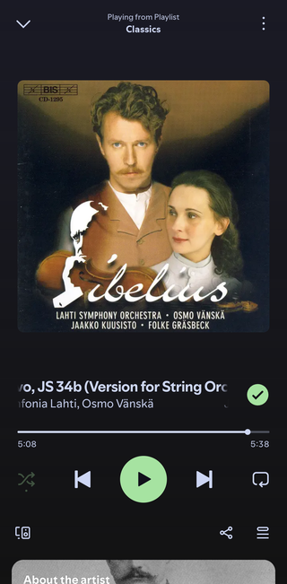</td>
    <td align="center">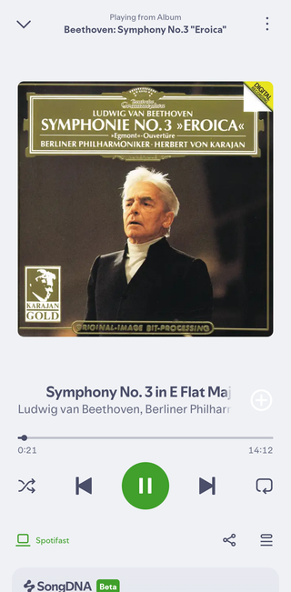</td>
  </tr>
  <tr>
    <th align="center">Mocha · Theme manager</th>
    <th align="center">Latte · Theme manager</th>
  </tr>
  <tr>
    <td align="center">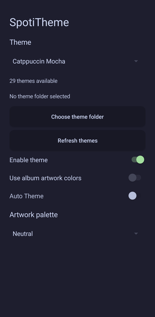</td>
    <td align="center">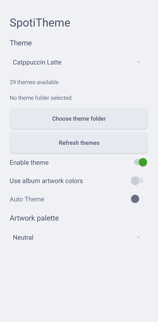</td>
  </tr>
</table>

<strong>Library · Mocha</strong> 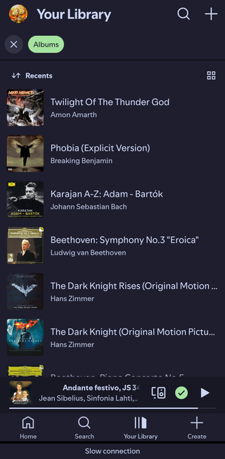

### Popular colorways

<table align="center">
  <tr><th align="center">Dracula</th><th align="center">Rose Pine Dawn</th></tr>
  <tr>
    <td align="center">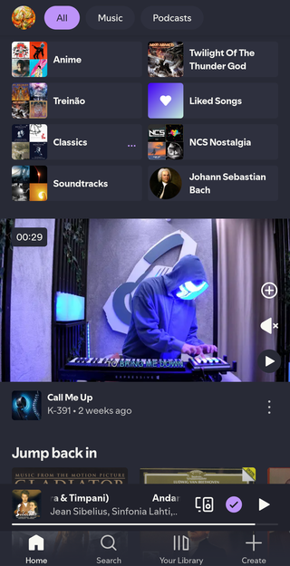</td>
    <td align="center">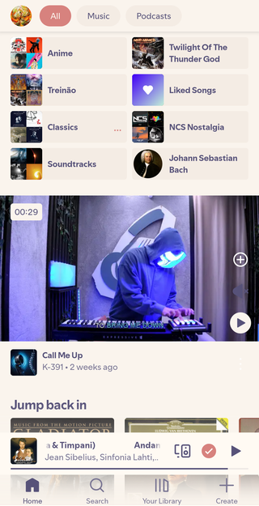</td>
  </tr>
  <tr><th align="center">Tokyo Night</th><th align="center">Gruvbox Dark</th></tr>
  <tr>
    <td align="center">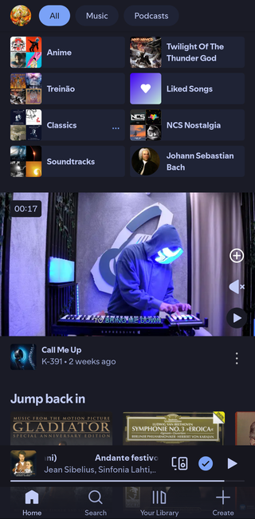</td>
    <td align="center">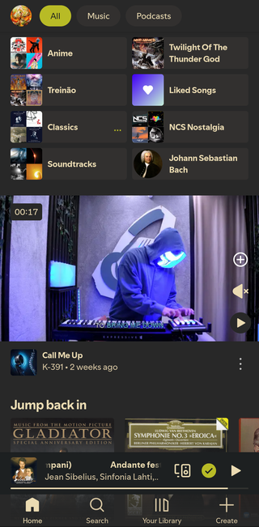</td>
  </tr>
</table>

## Theme library

29 themes.

<table>
  <thead>
    <tr><th>Palette</th><th>Base</th><th>Background</th><th>Surface</th><th>Accent</th><th>File</th></tr>
  </thead>
  <tbody>
<tr><td>Ayu Dark</td><td>Dark</td><td> <code>#0B0E14</code></td><td> <code>#080B0F</code></td><td> <code>#E6B450</code></td><td><a href="app/src/main/assets/themes/Ayu%20Dark.json">JSON</a></td></tr>
<tr><td>Ayu Mirage</td><td>Dark</td><td> <code>#212733</code></td><td> <code>#191E2A</code></td><td> <code>#FFCC66</code></td><td><a href="app/src/main/assets/themes/Ayu%20Mirage.json">JSON</a></td></tr>
<tr><td>Catppuccin</td><td>Dark</td><td> <code>#1E1E2E</code></td><td> <code>#232434</code></td><td> <code>#89B4FA</code></td><td><a href="app/src/main/assets/themes/Catppuccin.json">JSON</a></td></tr>
<tr><td>Catppuccin Frappe</td><td>Dark</td><td> <code>#303446</code></td><td> <code>#292C3C</code></td><td> <code>#A6D189</code></td><td><a href="app/src/main/assets/themes/Catppuccin%20Frappe.json">JSON</a></td></tr>
<tr><td>Catppuccin Latte</td><td>Light</td><td> <code>#EFF1F5</code></td><td> <code>#E6E9EF</code></td><td> <code>#40A02B</code></td><td><a href="app/src/main/assets/themes/Catppuccin%20Latte.json">JSON</a></td></tr>
<tr><td>Catppuccin Macchiato</td><td>Dark</td><td> <code>#24273A</code></td><td> <code>#1E2030</code></td><td> <code>#A6DA95</code></td><td><a href="app/src/main/assets/themes/Catppuccin%20Macchiato.json">JSON</a></td></tr>
<tr><td>Catppuccin Mocha</td><td>Dark</td><td> <code>#1E1E2E</code></td><td> <code>#181825</code></td><td> <code>#A6E3A1</code></td><td><a href="app/src/main/assets/themes/Catppuccin%20Mocha.json">JSON</a></td></tr>
<tr><td>Dracula</td><td>Dark</td><td> <code>#282A36</code></td><td> <code>#21222C</code></td><td> <code>#BD93F9</code></td><td><a href="app/src/main/assets/themes/Dracula.json">JSON</a></td></tr>
<tr><td>Everforest Dark</td><td>Dark</td><td> <code>#2D353B</code></td><td> <code>#232A2E</code></td><td> <code>#A7C080</code></td><td><a href="app/src/main/assets/themes/Everforest%20Dark.json">JSON</a></td></tr>
<tr><td>Everforest Light</td><td>Light</td><td> <code>#FDF6E3</code></td><td> <code>#F4F0D9</code></td><td> <code>#8DA101</code></td><td><a href="app/src/main/assets/themes/Everforest%20Light.json">JSON</a></td></tr>
<tr><td>Gruvbox Dark</td><td>Dark</td><td> <code>#282828</code></td><td> <code>#1D2021</code></td><td> <code>#B8BB26</code></td><td><a href="app/src/main/assets/themes/Gruvbox%20Dark.json">JSON</a></td></tr>
<tr><td>Gruvbox Light</td><td>Light</td><td> <code>#FBF1C7</code></td><td> <code>#F2E5BC</code></td><td> <code>#79740E</code></td><td><a href="app/src/main/assets/themes/Gruvbox%20Light.json">JSON</a></td></tr>
<tr><td>Gruvbox Material</td><td>Dark</td><td> <code>#282828</code></td><td> <code>#1E2022</code></td><td> <code>#A9B665</code></td><td><a href="app/src/main/assets/themes/Gruvbox%20Material.json">JSON</a></td></tr>
<tr><td>Kanagawa Dragon</td><td>Dark</td><td> <code>#181616</code></td><td> <code>#12120F</code></td><td> <code>#8BA4B0</code></td><td><a href="app/src/main/assets/themes/Kanagawa%20Dragon.json">JSON</a></td></tr>
<tr><td>Kanagawa Wave</td><td>Dark</td><td> <code>#1F1F28</code></td><td> <code>#16161D</code></td><td> <code>#98BB6C</code></td><td><a href="app/src/main/assets/themes/Kanagawa%20Wave.json">JSON</a></td></tr>
<tr><td>Monokai Pro</td><td>Dark</td><td> <code>#2D2A2E</code></td><td> <code>#221F22</code></td><td> <code>#A9DC76</code></td><td><a href="app/src/main/assets/themes/Monokai%20Pro.json">JSON</a></td></tr>
<tr><td>Nord</td><td>Dark</td><td> <code>#2E3440</code></td><td> <code>#242933</code></td><td> <code>#88C0D0</code></td><td><a href="app/src/main/assets/themes/Nord.json">JSON</a></td></tr>
<tr><td>Nord Light</td><td>Light</td><td> <code>#ECEFF4</code></td><td> <code>#E5E9F0</code></td><td> <code>#5E81AC</code></td><td><a href="app/src/main/assets/themes/Nord%20Light.json">JSON</a></td></tr>
<tr><td>One Dark</td><td>Dark</td><td> <code>#282C34</code></td><td> <code>#21252B</code></td><td> <code>#61AFEF</code></td><td><a href="app/src/main/assets/themes/One%20Dark.json">JSON</a></td></tr>
<tr><td>Ristretto</td><td>Dark</td><td> <code>#2C2525</code></td><td> <code>#322A2A</code></td><td> <code>#F38D70</code></td><td><a href="app/src/main/assets/themes/Ristretto.json">JSON</a></td></tr>
<tr><td>Rose Pine</td><td>Dark</td><td> <code>#191724</code></td><td> <code>#16141F</code></td><td> <code>#EBBCBA</code></td><td><a href="app/src/main/assets/themes/Rose%20Pine.json">JSON</a></td></tr>
<tr><td>Rose Pine Dawn</td><td>Light</td><td> <code>#FAF4ED</code></td><td> <code>#FFFAF3</code></td><td> <code>#D7827E</code></td><td><a href="app/src/main/assets/themes/Rose%20Pine%20Dawn.json">JSON</a></td></tr>
<tr><td>Rose Pine Moon</td><td>Dark</td><td> <code>#232136</code></td><td> <code>#1F1D30</code></td><td> <code>#EA9A97</code></td><td><a href="app/src/main/assets/themes/Rose%20Pine%20Moon.json">JSON</a></td></tr>
<tr><td>Solarized Dark</td><td>Dark</td><td> <code>#002B36</code></td><td> <code>#00212B</code></td><td> <code>#2AA198</code></td><td><a href="app/src/main/assets/themes/Solarized%20Dark.json">JSON</a></td></tr>
<tr><td>Solarized Light</td><td>Light</td><td> <code>#FDF6E3</code></td><td> <code>#EEE8D5</code></td><td> <code>#2AA198</code></td><td><a href="app/src/main/assets/themes/Solarized%20Light.json">JSON</a></td></tr>
<tr><td>Spotify Dark</td><td>Dark</td><td> <code>#121212</code></td><td> <code>#1F1F1F</code></td><td> <code>#1ED760</code></td><td><a href="app/src/main/assets/themes/spotify-dark.json">JSON</a></td></tr>
<tr><td>Synthwave 84</td><td>Dark</td><td> <code>#262335</code></td><td> <code>#1A1625</code></td><td> <code>#36F9F6</code></td><td><a href="app/src/main/assets/themes/Synthwave%2084.json">JSON</a></td></tr>
<tr><td>Tokyo Night</td><td>Dark</td><td> <code>#1A1B26</code></td><td> <code>#16161E</code></td><td> <code>#7AA2F7</code></td><td><a href="app/src/main/assets/themes/Tokyo%20Night.json">JSON</a></td></tr>
<tr><td>Tokyo Night Storm</td><td>Dark</td><td> <code>#24283B</code></td><td> <code>#1F2335</code></td><td> <code>#BB9AF7</code></td><td><a href="app/src/main/assets/themes/Tokyo%20Night%20Storm.json">JSON</a></td></tr>
  </tbody>
</table>

  
<strong>23 more palette previews</strong>

   
  <table align="center">
    <tr><td align="center" valign="top">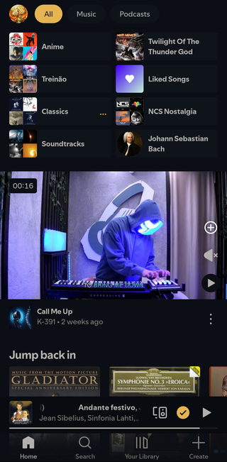 <strong>Ayu Dark</strong></td><td align="center" valign="top">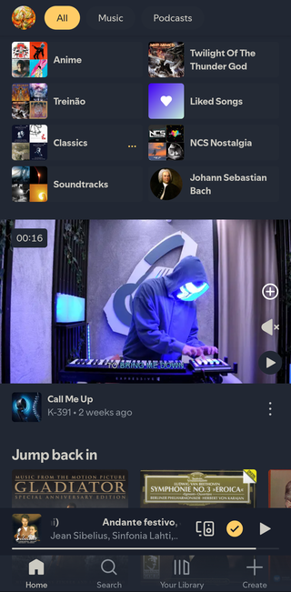 <strong>Ayu Mirage</strong></td></tr>
    <tr><td align="center" valign="top"> <strong>Catppuccin Frappe</strong></td><td align="center" valign="top">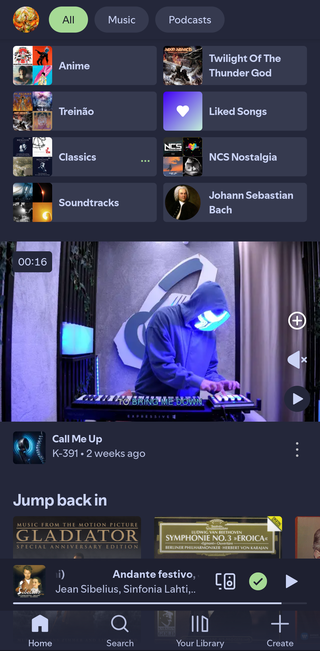 <strong>Catppuccin Macchiato</strong></td></tr>
    <tr><td align="center" valign="top">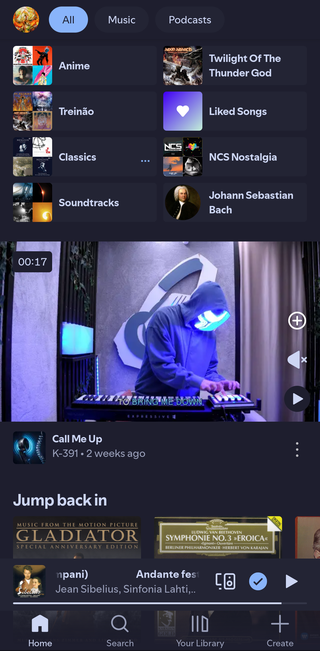 <strong>Catppuccin</strong></td><td align="center" valign="top">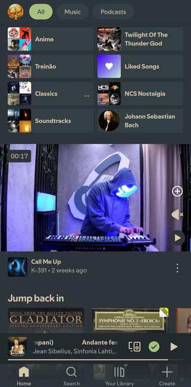 <strong>Everforest Dark</strong></td></tr>
    <tr><td align="center" valign="top">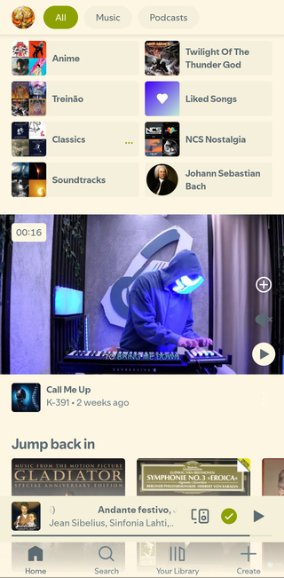 <strong>Everforest Light</strong></td><td align="center" valign="top">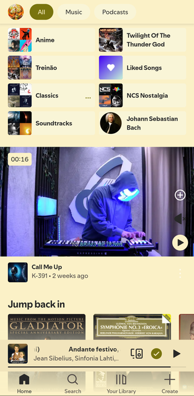 <strong>Gruvbox Light</strong></td></tr>
    <tr><td align="center" valign="top"> <strong>Gruvbox Material</strong></td><td align="center" valign="top">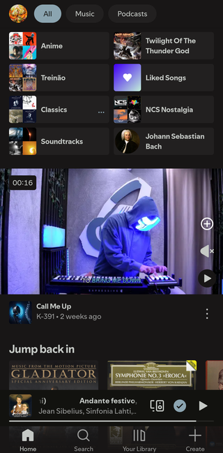 <strong>Kanagawa Dragon</strong></td></tr>
    <tr><td align="center" valign="top">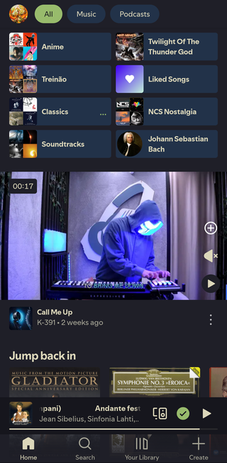 <strong>Kanagawa Wave</strong></td><td align="center" valign="top">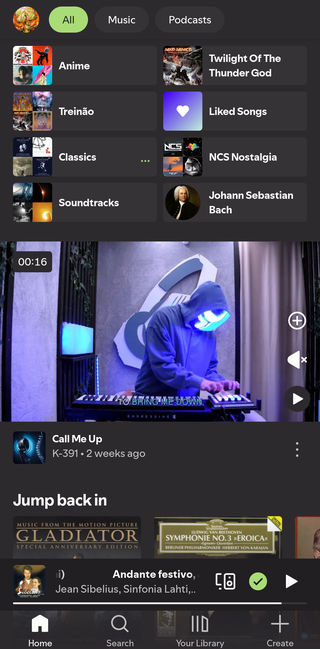 <strong>Monokai Pro</strong></td></tr>
    <tr><td align="center" valign="top">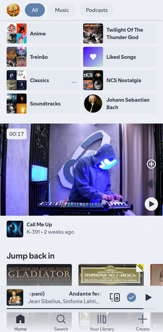 <strong>Nord Light</strong></td><td align="center" valign="top">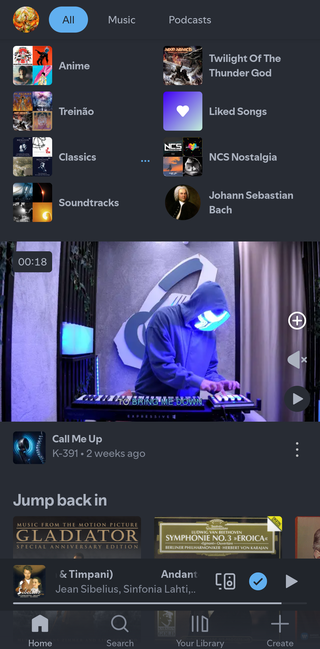 <strong>One Dark</strong></td></tr>
    <tr><td align="center" valign="top">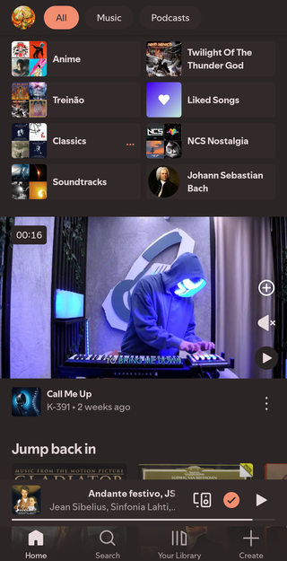 <strong>Ristretto</strong></td><td align="center" valign="top"> <strong>Rose Pine Dawn</strong></td></tr>
    <tr><td align="center" valign="top">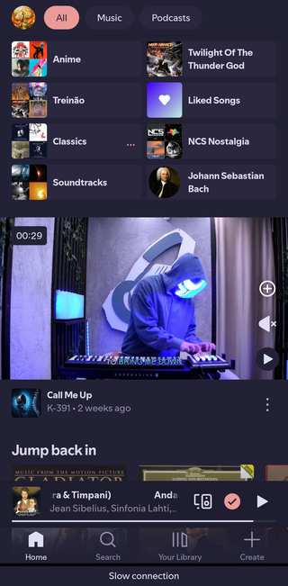 <strong>Rose Pine Moon</strong></td><td align="center" valign="top">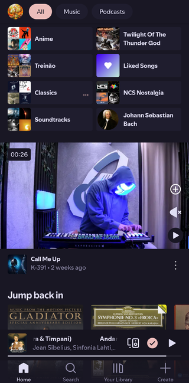 <strong>Rose Pine</strong></td></tr>
    <tr><td align="center" valign="top">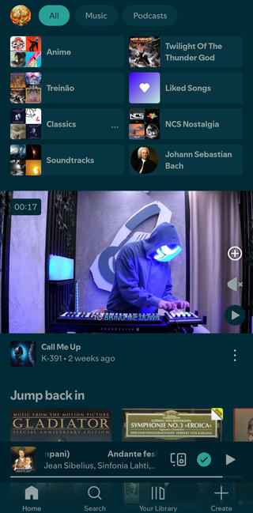 <strong>Solarized Dark</strong></td><td align="center" valign="top">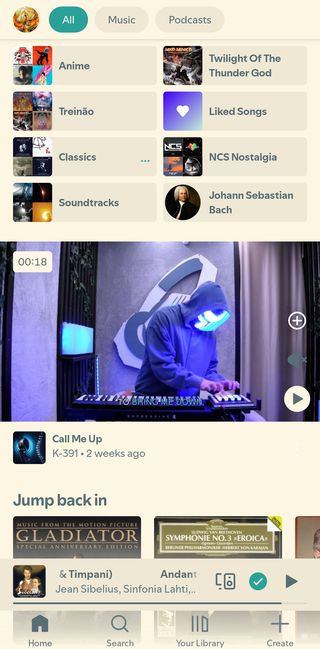 <strong>Solarized Light</strong></td></tr>
    <tr><td align="center" valign="top">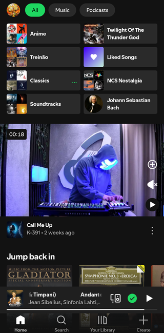 <strong>Spotify Dark</strong></td><td align="center" valign="top">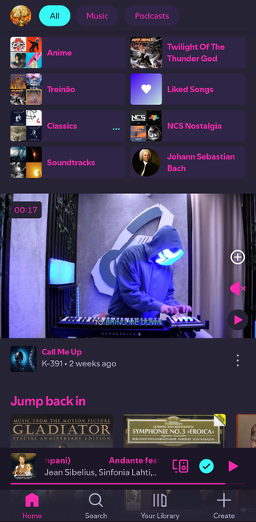 <strong>Synthwave 84</strong></td></tr>
    <tr><td align="center" valign="top">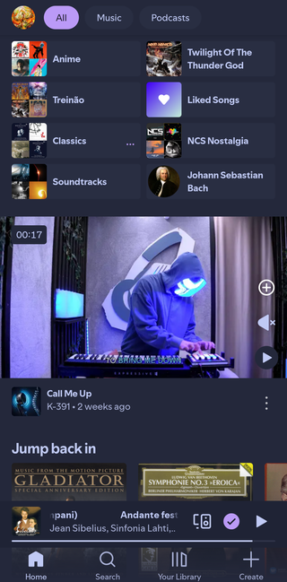 <strong>Tokyo Night Storm</strong></td><td></td></tr>
  </table>

## Architecture

<pre><code>Spotify 9.1.86.2432
  └─ Vector/Zygisk (root) or LSPatch (rootless)
       └─ XposedLoader
            └─ Profile_9_1_86_2432
                 └─ exact methods and fields
                      └─ semantic palette hooks
                           ├─ Encore / Android Views
                           └─ Jetpack Compose
                                └─ selected JSON palette or static Auto Theme palette</code></pre>

There is no runtime DexKit dependency or candidate-member scan. The profile names the expected methods and fields for this exact Spotify build; a new Spotify release requires re-verifying those identities instead of falling back to discovery. See <a href="docs/REFLECTION_PROFILE.md">the reflection profile</a> for the mapping and its validation boundaries.

Startup timing is informational rather than a release threshold. The latest clean start of the final rootless build registered the module in <strong>241.164 ms</strong> cumulative main-thread time on the pinned Android 16/API 36 device. SpotiTheme makes no sub-50 ms claim.

## Compatibility

| Requirement   | Supported / tested value                                                                                                                                                     |
| ------------- | ---------------------------------------------------------------------------------------------------------------------------------------------------------------------------- |
| Spotify       | <strong>9.1.86.2432</strong>, version code <strong>146555520</strong> only                                                                                                   |
| Android       | Module minimum API 27; Android 10+ is a practical baseline. On-device validation was performed on <strong>Android 16 / API 36</strong>                                       |
| Rooted mode   | Magisk with Zygisk and an operational Vector installation                                                                                                                    |
| Rootless mode | LSPatch injection and manager-selected palette switching verified on Android 16/API 36 with Spotify outside Vector scope; a separate truly-unrooted device test remains open |
| Theme files   | Version-1 JSON, UTF-8, at most 64 KiB per file; up to 128 files in the selected folder                                                                                       |
| Build         | JDK 21, Android SDK/`apksigner`, ADB, Gradle wrapper; Python 3 is required for rootless preparation                                                                          |

## Pin Spotify to the supported build

> [!TIP]
> On a rooted device, <a href="https://github.com/j-hc/zygisk-detach">zygisk-detach</a> can hide Spotify from Play Store update checks. Install and configure that module separately, reboot if its installation requests it, then run the CLI and select <code>com.spotify.music</code>:
>
> <pre><code>su -c /data/adb/modules/zygisk-detach/detach</code></pre>
>
> This controls Play Store visibility; it does not prevent a manually installed APK from replacing Spotify.

Rootless installs use an LSPatch-signed APK set. Preparation adds only a narrow package-visibility query for SpotiTheme's settings provider; it does not use `QUERY_ALL_PACKAGES`. On the test handset, Spotify was removed from Vector scope for rootless validation. The handset still has Magisk, so acceptance on a separate truly-unrooted device remains open.

## Installation

For rooted GUI installation, download the <strong>SpotiTheme APK</strong> from <a href="https://github.com/Nerver-zip/SpotiTheme/releases/latest">GitHub Releases</a> and follow <a href="#manual-installation-through-the-phone-ui">the phone UI instructions</a>. No clone, terminal or build tools are needed. Release assets become available after the first tagged release.

For rootless setup without cloning, download <strong>SpotiTheme-installer-vMAJOR.MINOR.PATCH.tar.gz</strong> from the same release, extract it on your computer, open a terminal in its <code>SpotiTheme-installer</code> folder and run:

<pre><code>bash install.sh --rootless --check
bash install.sh --rootless</code></pre>

This bundle contains the release APK and patching tools; it does not compile the app or include Spotify. It requires Bash, ADB, Python 3, JDK 21 and Android SDK build-tools 35.0.0 (<code>apksigner</code>). Enable USB debugging, connect the phone, approve its USB prompt and keep the supported store-signed Spotify build installed before starting. Keep the extracted folder: original Spotify APK backups are saved inside its <code>.project</code> directory. See <a href="installer/README.md">the installer guide</a> for signing and data-loss details.

For development from a source checkout, run:

<pre><code>./installer/install.sh --check
./installer/install.sh --root
./installer/install.sh --rootless</code></pre>

- <code>--check</code> verifies the connected device, pinned Spotify identity, and available framework prerequisites without installing or changing scope.
- <code>--root</code> builds and tests the module, installs it, enables <code>com.spotitheme</code> in Vector, and adds Spotify to the module scope after confirmation. Restart Spotify to load a newly installed module.
- <code>--rootless</code> pulls Spotify split APKs, prepares a local LSPatch build, verifies the result, then prompts before replacing the store-signed app.

The installer refuses other Spotify versions rather than upgrading or downgrading the app. It does not start playback. See <a href="installer/README.md">the installation guide</a> for prerequisites, prompts, signing details, and recovery behavior.

### Manual installation through the phone UI

These steps use Android screens and Vector, with no terminal or ADB commands. Download the <strong>SpotiTheme APK</strong> from <a href="https://github.com/Nerver-zip/SpotiTheme/releases/latest">GitHub Releases</a> to your phone. Building from source is a separate developer task; the source repository itself is not an installable APK. Spotify must already be the supported <strong>9.1.86.2432 / 146555520</strong> build. Check its version in Android <strong>Settings → Apps → Spotify</strong>; stop if it differs.

#### Rooted device with Vector

1. Ensure Magisk has Zygisk enabled and Vector is operational. If Vector is not installed, download its module from the <a href="https://github.com/JingMatrix/Vector/releases">official releases</a>, open <strong>Magisk → Modules → Install from storage</strong>, select the module ZIP and reboot. Follow <a href="https://github.com/JingMatrix/Vector#installation">Vector's installation instructions</a> for the Zygisk environment required by your setup.
2. Open the SpotiTheme APK in your file manager and tap <strong>Install</strong>. If Android asks, allow that file manager to install unknown apps. SpotiTheme is an APK, not a Magisk module ZIP.
3. Open <strong>Vector</strong> from its manager shortcut or system notification. Go to <strong>Modules → SpotiTheme</strong> and enable the module.
4. In SpotiTheme's scope, select <strong>Spotify (com.spotify.music)</strong> for the Android user where it is installed. This project's validated setup uses the primary user (user 0). Do not select unrelated apps or system processes.
5. If another theming module targets Spotify, open that module's scope and uncheck only Spotify to avoid competing hooks.
6. Open Android <strong>Settings → Apps → Spotify → Force stop</strong>, then launch Spotify again. Removing it from Recents alone does not reliably reload hooks. Do not clear its storage or uninstall it.
7. Open <strong>SpotiTheme</strong> from the launcher and configure the theme as described below.

The Vector CLI and USB debugging are not required for this route. Installing an updated SpotiTheme APK with the same signing key follows the same Android installation flow; force-stop and reopen Spotify afterward.

#### Rootless device

<a href="https://github.com/JingMatrix/LSPatch#usage">LSPatch provides a manager UI</a> that can patch and install apps without a terminal. However, an end-to-end SpotiTheme installation through that UI has <strong>not been validated</strong>. The supported rootless preparation currently uses this project's installer: it adds the settings-provider visibility query, embeds SpotiTheme, preserves all Spotify splits and verifies their signatures. We have not established an equivalent GUI-only preparation flow for these steps. Installing only the SpotiTheme APK does not inject hooks into an unpatched Spotify app.

For rootless setup, use the downloadable installer bundle from the <a href="#installation">regular installation instructions</a>; no clone or app build is required. Preparation still uses a host terminal. Follow the <a href="installer/README.md">installation guide</a>. Replacing the store-signed Spotify app requires uninstalling it, deletes local Spotify data and requires signing in again. Keep the original APK split backup for recovery. A separate truly-unrooted-device validation also remains open.

#### Choose a theme and check the result

Open <strong>SpotiTheme</strong>, choose a theme and leave <strong>Enable theme</strong> on. For a fixed palette, leave <strong>Use album artwork colors</strong> off; Auto Theme is then unchecked and disabled. Player backdrop handling is automatic and has no switch. To import JSON themes, tap <strong>Choose theme folder</strong>, select the folder, grant read access and tap <strong>Refresh themes</strong> after changing its files.

Open Spotify and check Home and the expanded player visually. If a newly installed module is not taking effect, use Android <strong>Settings → Apps → Spotify → Force stop</strong> and reopen it. On the rooted route, also confirm SpotiTheme is enabled and Spotify is selected in Vector's scope. See <a href="docs/MVP_VALIDATION.md">MVP validation</a> for supported surfaces and remaining limits.

### Build and validate

GitHub Actions runs these host checks on pushes and pull requests. Version tags publish signed APKs and checksums; see <a href="docs/RELEASING.md">CI and release setup</a> for signing secrets and versioning.

<pre><code>./gradlew testDebugUnitTest assembleDebug
python3 -m unittest discover -s installer/tests -v
bash -n installer/install.sh installer/lib/*.sh
./installer/install.sh --check</code></pre>

LSPatch injection and manager-selected Latte/Mocha palettes were confirmed on Android 16/API 36 with Spotify removed from Vector scope. Rootless preparation adds a narrow provider query, with no `QUERY_ALL_PACKAGES` permission. The handset itself still has Magisk, so this does not count as acceptance on a separate truly-unrooted device.

### JSON theme format

Choose a folder in the manager, grant read access, and refresh after adding or changing theme files. Each file requires <code>schemaVersion</code>, a lowercase-hyphen <code>id</code>, a dark/light <code>base</code>, and a <code>colors</code> object. The display <code>name</code> is optional. Colors accept <code>#RRGGBB</code> or <code>#RRGGBBAA</code>; omitted color roles use defaults from the selected base palette. Each file is limited to 64 KiB.

<pre><code>{
  "schemaVersion": 1,
  "id": "my-mocha",
  "name": "My Mocha",
  "base": "dark",
  "colors": {
    "background": "#1E1E2E",
    "surface": "#181825",
    "text": "#CDD6F4",
    "accent": "#A6E3A1",
    "savedIndicator": "#A6E3A1"
  }
}</code></pre>

The saved-indicator color can differ from the accent. It controls the mini-player saved check and related save affordances where Spotify exposes a supported path.

## Validation boundaries

This is a pinned-build MVP, not a guarantee that every Spotify-owned color or renderer is themeable.

- Auto Theme is normalized to off whenever fixed-palette mode is active. Its switch is unchecked and disabled in that mode. Automatic player backdrop handling does not change either color-mode preference.
- The verified square-cover player path preserves foreground artwork and uses the theme background. The pinned main video surface retains Spotify's native backdrop; full-screen image/Canvas paths that lack a confirmed binding keep native behavior.
- Some native or alternate Spotify renderers may retain their original foreground colors.
- Related-video overflow, selected Repeat, and a positive queued-badge state had no available sample for SpotiTheme acceptance.
- Rootless LSPatch preparation adds the narrow SpotiTheme provider query and supports palette switching without `QUERY_ALL_PACKAGES`; Spotify was scoped out of Vector during the Android 16/API 36 test. A separate truly-unrooted device test remains open.
- Spotify Connect was visible as Spotifast in the app; Android's system route owner remained unverified.

See <a href="docs/MVP_VALIDATION.md">MVP validation</a>, <a href="docs/STARTUP_MEASUREMENT.md">startup measurement</a>, and <a href="docs/REFLECTION_PROFILE.md">reflection profile</a> for evidence and limitations.

## Acknowledgements

- <a href="https://github.com/LeNerd46/SpotifyPlus">LeNerd46/SpotifyPlus</a> — original hook foundations, retained under its MIT license; see <a href="LICENSE">LICENSE</a>.
- <a href="https://github.com/JingMatrix/Vector">JingMatrix/Vector</a> — modern Zygisk/Xposed framework.
- <a href="https://github.com/LuckyPray/DexKit">LuckyPray/DexKit</a> — bytecode-analysis tooling used during research; DexKit is not included as a runtime dependency.
